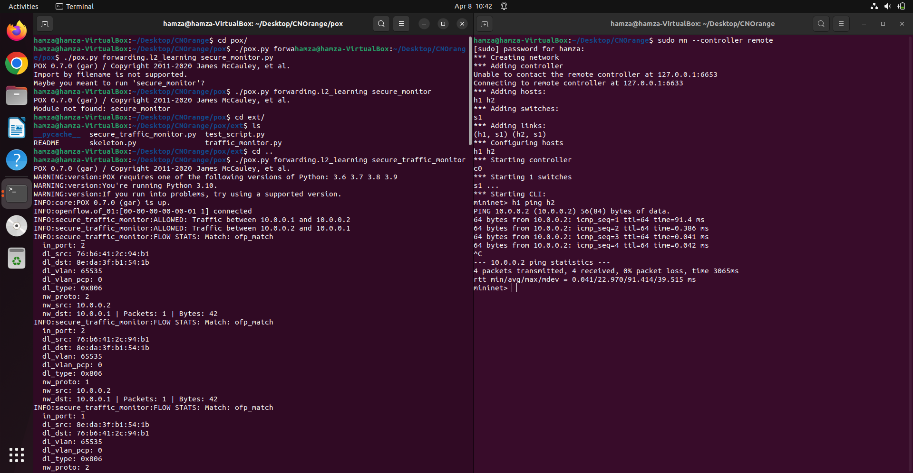
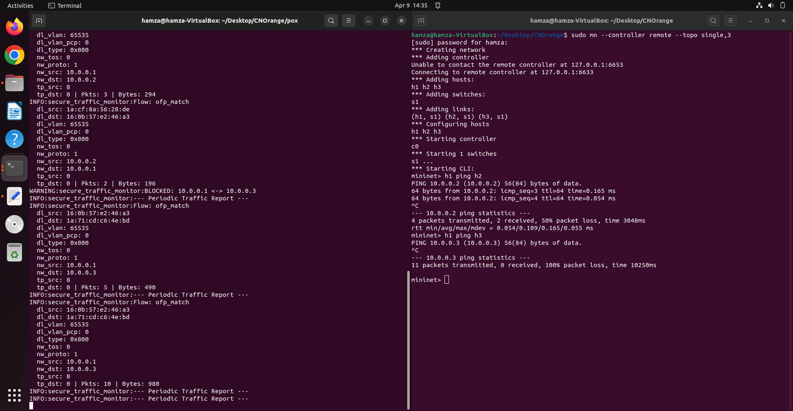
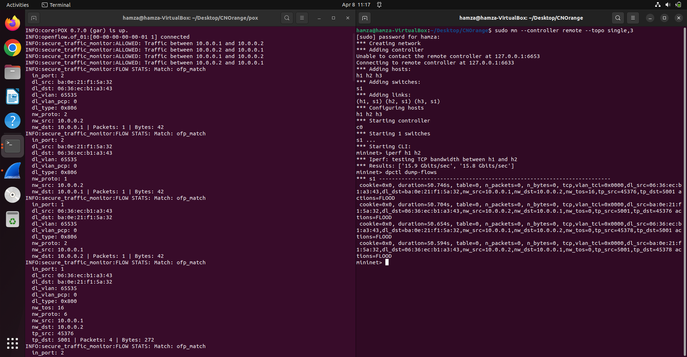
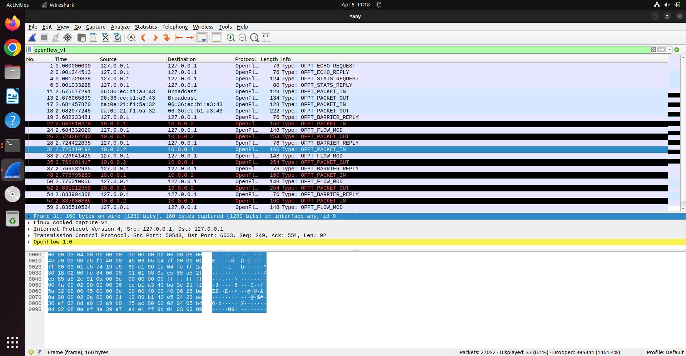

# Traffic Monitoring And Statistics Collector

By - Hamza Shabbir Sahapurwala

SRN - PES2UG24CS177

SDNReport.docx also contains all the Screenshots.

## Problem Statement

Build a controller module that collects and displays traffic statistics.

## Project Expectations

- Retrieve flow statistics

- Display packet/byte counts

- Periodic monitoring

- Generate simple reports

## Prerequisites in Ubuntu

1. POX

2. Mininet

3. Copy the secure_traffic_monitor.py and paste it in pox/ext/ folder.

## How To Run

1. In a Ubuntu terminal, go to the POX folder(it is not in this repository as POX is a Licensed Github Repository) and type in:

`./pox.py secure_traffic_monitor`

2. Open another terminal, type in:

`sudo mn --controller --topo single,3`

3. Now the brain of the network (POX) and the structure of the network (Mininet) is alive.

## Checking (All to typed into the mininet terminal)

1. For Allowed Connections:

`h1 ping h2`

The packets will be transferred.

2. For Blocked Connections:

`h1 ping h3`

No packets will be transferred.

3. For Normal vs Failure Connections:

`iperf h1 h2`

`dpctl dump-flows`

The failed packet will be sent again and again for verification. (To be verified by Wireshark)

## SCREENSHOTS

1. Allowed:

2. Blocked:

3. Normal: 

4. Failure:

